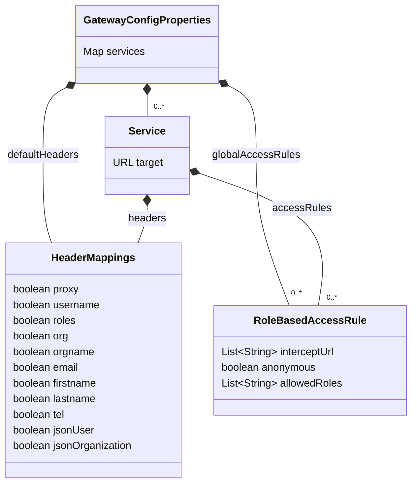

# Configuration properties

## Configuration object model



## Example YAML configuration

```yaml
georchestra:
  gateway:
    default-headers:
      proxy: true
      username: true
      roles: true
      org: true
      orgname: true
    global-access-rules:
    - intercept-url: /**
      anonymous: true
    services:
      analytics:
        target: http://analytics:8080/analytics/
        access-rules:
        - intercept-url: /analytics/**
          allowed-roles: SUPERUSER, ORGADMIN
      atlas: 
        target: http://atlas:8080/atlas/
      console: 
        target: http://console:8080/console/
        access-rules:
        - intercept-url:
          - /console/public/**
          - /console/manager/public/**
          anonymous: true
        - intercept-url:
          - /console/private/**
          - /console/manager/**
          allowed-roles: SUPERUSER, ORGADMIN
```